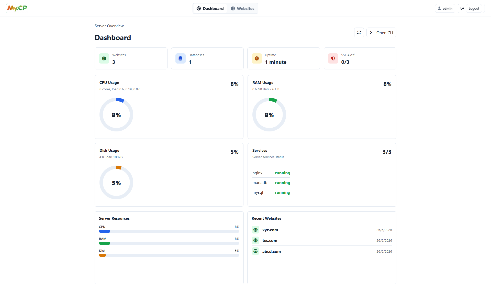
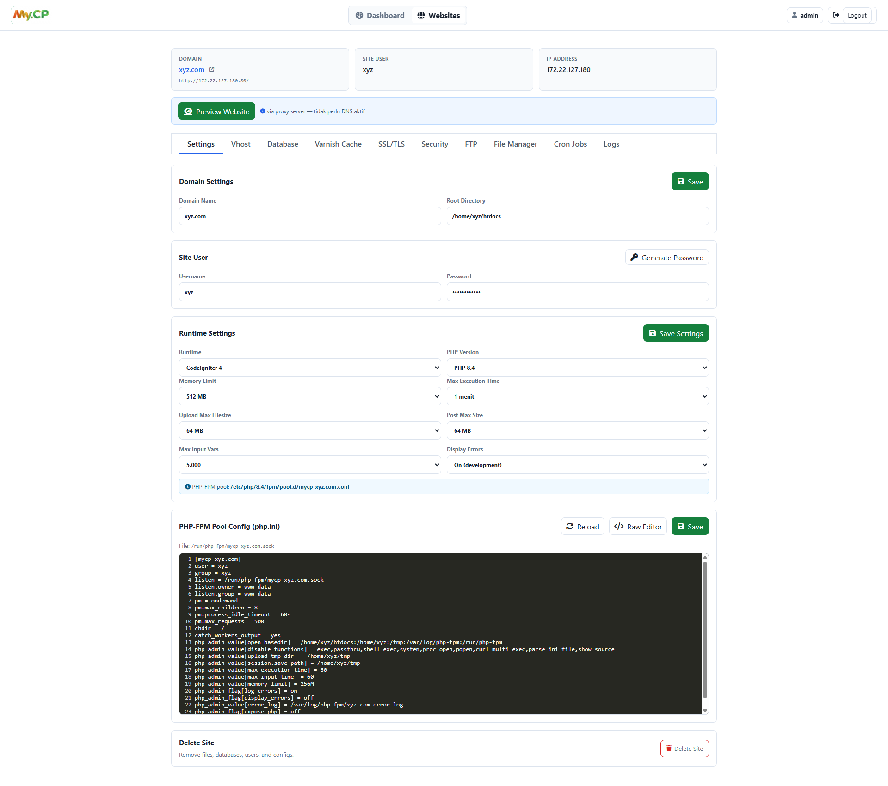
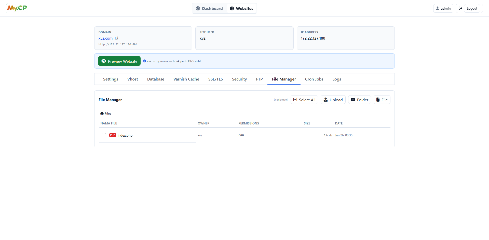
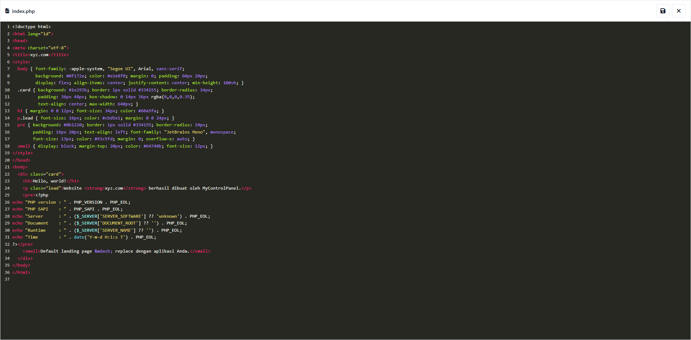
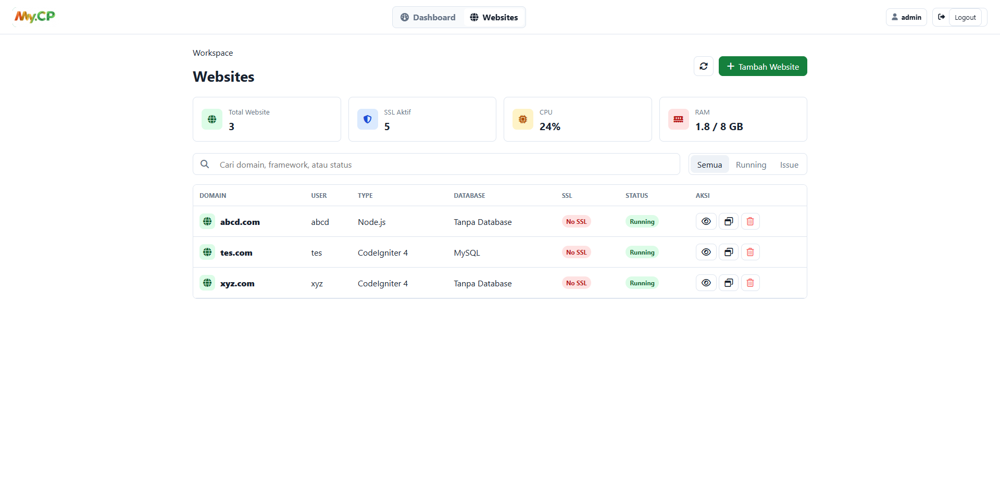
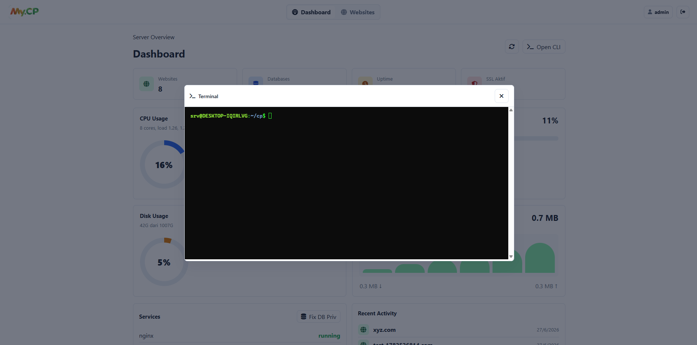

# MyControlPanel

<p align="center">
  
</p>

Panel manajemen hosting ringan berbasis Node.js + Bash, untuk mengelola
website (PHP, Node.js, Static) plus database (MySQL/MariaDB, PostgreSQL),
FTP, cron jobs, dan SSL.

Dibangun untuk berjalan di hampir semua Linux: Debian, Ubuntu, WSL,
CentOS / RHEL / AlmaLinux / Rocky, Fedora, Arch.

---

## Screenshots

| Dashboard | Detail Settings | File Manager |
|:---:|:---:|:---:|
|  |  |  |

| File Editor | Website Preview | Terminal |
|:---:|:---:|:---:|
|  |  |  |

---

## Fitur

- **Multi-Runtime**: PHP Native, CodeIgniter 3/4, Laravel, Node.js, Static HTML, Reverse Proxy
- **Multi-PHP**: Setiap website bisa pakai PHP versi berbeda (7.4 – 8.4) lewat **PHP-FPM pool terisolasi** per site
- **Multi-Node.js**: Via NVM (Node Version Manager)
- **Database**: MySQL/MariaDB + PostgreSQL, masing-masing dengan user & database unik per site
- **Isolasi Penuh Per-Site**:
  - OS user terpisah (`/home/{user}/htdocs`)
  - PHP-FPM pool terpisah (`/etc/php/{ver}/fpm/pool.d/mycp-{domain}.conf`)
  - Socket terpisah (`/run/php-fpm/mycp-{domain}.sock`)
  - `open_basedir` terkunci ke folder site sendiri
  - `disable_functions` (no exec, shell_exec, dll)
  - Memory limit & `max_execution_time` per site
  - Database user hanya punya akses ke DB site-nya sendiri
- **File Manager**: Upload, edit, rename, chmod, compress (zip), copy/cut/paste
- **Cron Jobs**, **FTP Accounts**, **SSL/TLS** (Let's Encrypt)
- **phpMyAdmin** integration
- **Preview Proxy**: Lihat website tanpa perlu setup DNS

---

## Instalasi

### Prasyarat

- Linux server / VPS / WSL dengan akses `sudo` atau `root`
- Koneksi internet untuk download paket
- Minimal 1 GB RAM, 5 GB disk

### Quick Install (VPS / Bare Metal)

```bash
curl -fsSL https://s.id/mycontrolpanel -o install.sh
chmod +x install.sh
sudo bash install.sh
```

Atau lewat URL panjang:

```bash
curl -fsSL https://raw.githubusercontent.com/ekohendratno/mycp/refs/heads/main/deploy/install.sh -o install.sh
chmod +x install.sh
sudo bash install.sh
```

Script akan auto-detect environment:
- **User panel** → terdeteksi dari `SUDO_USER` atau user pemilik direktori
- **Lokasi instalasi** → `/home/{user}/mycp` atau dari `pwd` jika di dalam repo
- **PHP version** → semua versi yang tersedia di repositori distro

### Custom Install

```bash
# Pilih versi PHP spesifik
sudo INSTALL_PHP_VERSIONS="8.1 8.2 8.3 8.4" bash install.sh

# Tanpa database (panel only)
sudo INSTALL_MARIADB=no INSTALL_POSTGRES=no bash install.sh

# Tanpa FTP
sudo INSTALL_FTP=no bash install.sh

# Custom user & password (jika auto-detect tidak sesuai)
sudo APP_USER=admin APP_PASSWORD='MyS3cret!' bash install.sh
```

### Install di WSL (Windows)

```bash
# 1. Buka terminal WSL Ubuntu/Debian
wsl -e bash

# 2. Download installer langsung
curl -fsSL https://s.id/mycontrolpanel -o install.sh
chmod +x install.sh
sudo bash install.sh
```

---

## Distro yang Didukung

| Distro        | Versi                 | Package Manager | PHP Repo         |
| ------------- | --------------------- | --------------- | ---------------- |
| Debian        | 11 / 12 / 13          | apt             | Sury (untuk 7.4) |
| Ubuntu        | 20.04 / 22.04 / 24.04 | apt             | PPA ondrej/php   |
| WSL           | Ubuntu / Debian       | apt             | sesuai base      |
| CentOS Stream | 8 / 9                 | dnf             | Remi             |
| RHEL          | 8 / 9                 | dnf             | Remi             |
| AlmaLinux     | 8 / 9                 | dnf             | Remi             |
| Rocky Linux   | 8 / 9                 | dnf             | Remi             |
| Fedora        | 38+                   | dnf             | Module default   |
| Arch Linux    | rolling               | pacman          | repo Arch        |
| Manjaro       | rolling               | pacman          | repo Arch        |

---

## Akses Panel

Setelah install berhasil, lihat output:

```
Panel URL lokal : http://127.0.0.1:8089/login
Panel URL LAN   : http://<IP_SERVER>:8089/login
Login default   : admin / admin123
```

Panel bisa diakses via **Nginx proxy** di port 80 (tanpa `:8089`) jika DNS sudah mengarah ke server.

Login pertama → ganti password di **Settings** setelah login.

---

## Cara Pakai

### Buat Website Baru

1. Login ke panel
2. Klik **Tambah Website**
3. Isi:
   - **Domain**: `example.com`
   - **Username**: `example` (slug otomatis)
   - **Password**: minimal 8 karakter
   - **Runtime**: CodeIgniter 4 / 3 / Laravel / PHP / Node.js / Static HTML / Reverse Proxy
   - **PHP Version**: otomatis menyesuaikan runtime
   - **Port**: 80 (default), atau 3000 untuk Node.js
   - **SSL**: centang untuk Let's Encrypt
4. Klik **Buat Website**

Otomatis terbuat:

- User OS `example` dengan home `/home/example/htdocs`
- PHP-FPM pool di `/etc/php/{ver}/fpm/pool.d/mycp-example.com.conf`
- Nginx vhost di `/etc/nginx/sites-available/mycp-example.com`
- File `index.php` Hello World di `/home/example/htdocs/`
- Database MySQL `example_db` + user `example_user`

### Kelola Website

Klik **Detail** di samping website → buka:

| Tab              | Fungsi                                               |
| ---------------- | ---------------------------------------------------- |
| **Settings**     | Ganti domain, root dir, user, password, PHP settings |
| **Vhost**        | Edit Nginx vhost (raw)                               |
| **Database**     | Buat database MySQL/PostgreSQL baru, buka phpMyAdmin |
| **SSL/TLS**      | Issue Let's Encrypt, upload custom cert              |
| **Security**     | Basic Auth, Bot Protection                           |
| **FTP**          | Buat akun FTP                                        |
| **File Manager** | Upload, edit, hapus file/folder                      |
| **Cron Jobs**    | Tambah cron schedule                                 |
| **Logs**         | Lihat access & error logs                            |

---

## PHP-FPM Pool Isolation

Setiap website punya PHP-FPM pool terpisah dengan setting keamanan:

```ini
[mycp-example.com]
user = example
group = example
listen = /run/php-fpm/mycp-example.com.sock
pm = ondemand
pm.max_children = 8
php_admin_value[open_basedir] = /home/example/htdocs:/home/example:/tmp
php_admin_value[disable_functions] = exec,passthru,shell_exec,system,proc_open,popen
php_admin_value[memory_limit] = 256M
php_admin_value[max_execution_time] = 60
php_admin_flag[display_errors] = off
php_admin_flag[expose_php] = off
php_admin_value[upload_tmp_dir] = /home/example/tmp
php_admin_value[session.save_path] = /home/example/tmp
php_admin_value[error_log] = /var/log/php-fpm/example.com.error.log
```

Artinya:

- Site A tidak bisa baca file Site B (open_basedir)
- Site A tidak bisa `exec()` shell command
- Site A dibatasi 256M memory
- Versi PHP tidak bocor ke client (expose_php=off)
- Session & upload tidak shared antar site
- Log error per-site

---

## Perintah CLI `mycp`

Setelah install, tersedia CLI helper:

```bash
mycp status                 # Cek status server
mycp site:list              # List semua website
mycp site:create --domain example.com --username example --password 'P@ss123!'
mycp site:delete --domain example.com
mycp site:update-domain --domain old.com --new-domain new.com
mycp site:password --domain example.com --password 'NewP@ss'
mycp vhost:save --domain example.com
mycp db:create --domain example.com --database example_db --user example_user --password 'DBp@ss'
mycp ftp:create --domain example.com --user ftpuser --password 'FTPp@ss'
mycp cron:add --domain example.com --schedule "*/5 * * * *" --command "php artisan queue:work"
mycp restart                # Restart panel + nginx
mycp path                   # Path instalasi panel
mycp url                    # URL panel
```

---

## Troubleshooting

### Port 8089 sudah dipakai

Ubah environment PORT:

```bash
sudo systemctl edit mycp-server
# Tambahkan:
# [Service]
# Environment=PORT=9090
sudo systemctl restart mycp-server
```

Atau set di `.env`:

```bash
echo "PORT=9090" >> /opt/mycontrolpanel/.env
sudo systemctl restart mycp-server
```

### PHP-FPM gagal start

```bash
# Cek log (ganti 8.4 dengan versi PHP yang terinstall)
sudo tail -50 /var/log/php8.4-fpm.log
sudo tail -50 /var/log/syslog | grep php-fpm

# Test config (ganti 8.4 dengan versi PHP)
sudo php-fpm8.4 -t
```

### Nginx config error

```bash
sudo nginx -t
sudo tail -50 /var/log/nginx/error.log
```

### Website 500 Error

```bash
# Cek error log per-site
sudo tail -50 /var/log/php-fpm/example.com.error.log

# Aktifkan display_errors sementara via panel:
# Settings → Display Errors → On (development)
```

### Permission denied di file manager

```bash
# Fix ownership
sudo chown -R example:example /home/example/htdocs
```

### PHP version tidak tersedia

Jika Anda pilih versi PHP yang belum terinstall (mis. 7.4 di Debian 13), panel otomatis fallback ke versi terbaru + tampil warning banner. Solusi:

```bash
# Install PHP 7.4 (Debian/Ubuntu)
sudo apt install php7.4-fpm php7.4-cli php7.4-mysql php7.4-xml php7.4-mbstring php7.4-curl

# Restart pool
sudo systemctl restart php7.4-fpm
```

---

## Arsitektur

```
┌─────────────────────────────────────────────────────────────┐
│  Browser                                                     │
└─────────────────────────────────────────────────────────────┘
            │ HTTP (80)
            ▼
┌─────────────────────────────────────────────────────────────┐
│  Nginx                                                       │
│  ├─ :80 → reverse proxy ke Node.js :8089                    │
│  └─ :80/site1.com → fastcgi_pass unix:/run/php-fpm/        │
│                       mycp-site1.com.sock                    │
└─────────────────────────────────────────────────────────────┘
            │
            ▼
┌─────────────────────────────────────────────────────────────┐
│  Node.js (panel di port 8089)                               │
│  - EJS views                                                 │
│  - Express REST API                                          │
│  - exec shell scripts via sudo                               │
└─────────────────────────────────────────────────────────────┘
            │
            ▼
┌─────────────────────────────────────────────────────────────┐
│  PHP-FPM (multi-version: 7.4, 8.1, 8.2, 8.3, 8.4)           │
│  ├─ Pool mycp-site1.com (user=site1, open_basedir=/home/...) │
│  ├─ Pool mycp-site2.com (user=site2, open_basedir=/home/...) │
│  └─ Pool mycp-site3.com (user=site3, open_basedir=/home/...) │
└─────────────────────────────────────────────────────────────┘
            │
            ▼
┌─────────────────────────────────────────────────────────────┐
│  MariaDB / MySQL + PostgreSQL                                │
│  ├─ Database site1_db (user site1_user)                      │
│  ├─ Database site2_db (user site2_user)                      │
│  └─ Database site3_db (user site3_user)                      │
└─────────────────────────────────────────────────────────────┘
```

---

## File Penting

| File                           | Tujuan                            |
| ------------------------------ | --------------------------------- |
| `deploy/install.sh`            | Installer multi-distro            |
| `deploy/start-server.sh`       | Startup script (auto-detect APP_DIR) |
| `server/config.js`             | Central config (semua path dari env) |
| `server/app.js` + `server/routes/*` | Backend Express modular (16 route files) |
| `server/models/db.js`          | JSON-based data store             |
| `scripts/lib/common.sh`        | Library bash (central path vars)  |
| `scripts/site-create.sh`       | Provisioning website baru         |
| `scripts/phpini-save.sh`       | PHP-FPM pool config + isolation   |
| `scripts/vhost-save.sh`        | Generate Nginx vhost              |
| `scripts/database-create.sh`   | MySQL/PostgreSQL provisioning     |
| `scripts/ftp-create.sh`        | Akun FTP per-site                 |
| `views/detail.ejs`             | Dashboard detail site             |
| `views/index.ejs`              | Dashboard list + form tambah site |
| `views/terminal.ejs`           | WebSocket terminal via xterm.js   |
| `assets/js/detail.js`          | Frontend detail page logic        |
| `assets/vendor/xterm/`         | xterm.js vendor (terminal)        |
| `templates/index.php.template` | Hello World landing page (PHP)    |
| `templates/node-server.js.template` | Hello World landing page (Node.js) |

Semua path bisa di-override via environment variable (lihat `.env.example`).

---

## Lisensi

MIT License

---

## Kontribusi

Pull request welcome! Sebelum kontribusi, baca dulu `DEPLOY_NOTES.md` dan `install.sh` agar paham arsitektur.

Untuk issue & pertanyaan, buat GitHub issue.
